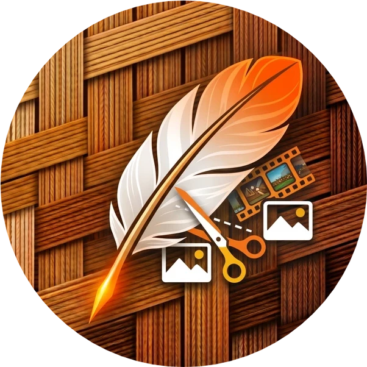

# CelSuite Quick Utility Image Studio
**The whole pixel kitchen in one quick window — compress, convert, trace PNG→SVG, slice game assets, auto-frame, sprite-resize. Zero cloud, zero wait, zero bloat.**
* * *

   

## 🌟 Overview
**CelSuite Quick Utility Image Studio (QUIS)** is the CelSuite family's pocket pixel kitchen: a single small desktop window that does the twenty image chores every dev/artist repeats daily, instantly and offline.
## 📦 Downloads & Releases
All artifacts are built by GitHub Actions on every tag.
👉 **Latest: v269.30.0**
| Platform | Asset | Notes |
| --- | --- | --- |
| 🪟 Windows | `CelSuite_QUIS-v269.30.0-Windows.exe` | One-file portable, zero install |
| 🐧 Linux | `CelSuite_QUIS-v269.30.0-Linux.bin` | One-file portable, `chmod +x` |
| 🐍 Source | `CelSuite_QUIS-v269.30.0-Source.zip` | Runs with `python main.py` + requirements.txt |
## ✨ Key Features
- 🗜️ **Compress** — re-encode PNG/WebP/JPEG with a live size preview
- 🔁 **Convert** — batch convert between formats in one drop
- ✒️ **PNG→SVG** — one-click vector trace for logos & sprites
- 🔪 **Slice** — game-asset sprite-sheet slicing with grid preview
- 🎞️ **Auto-Frame** — auto-crop & frame sprites to uniform frames
- 📐 **Sprite Resize** — nearest-neighbor batch resize, no blur
- 🪶 **Lite by design** — minimum-dependency, minimum footprint, instant launch
## 🛠️ Quick Setup
1. Download the one-file build for your OS (or Source zip + `pip install -r requirements.txt`).
2. Run. Drop images. Done. No account, no cloud, no telemetry.
## 📜 Changelog
See CHANGELOG.md.
## 📄 License
Proprietary — © 2026 HenryJayz. All rights reserved. Redistribution of unmodified binaries welcome; claiming them as yours is not.

